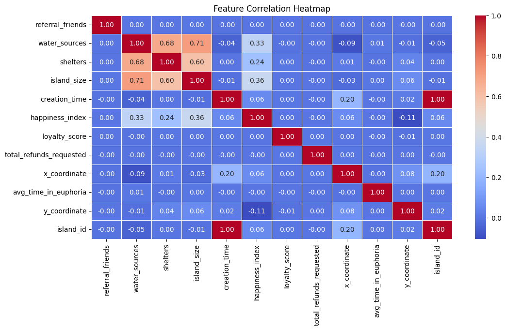
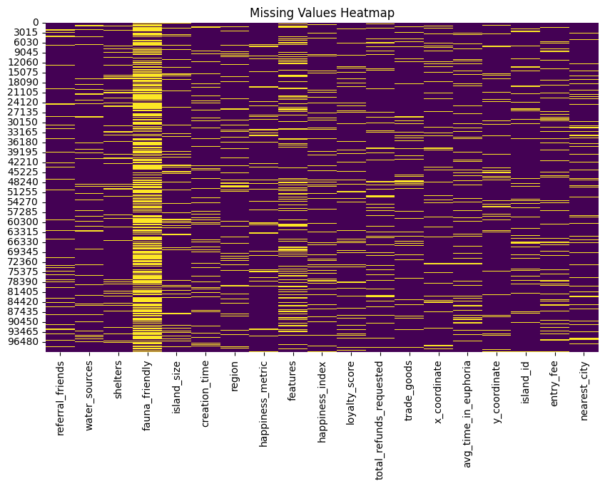
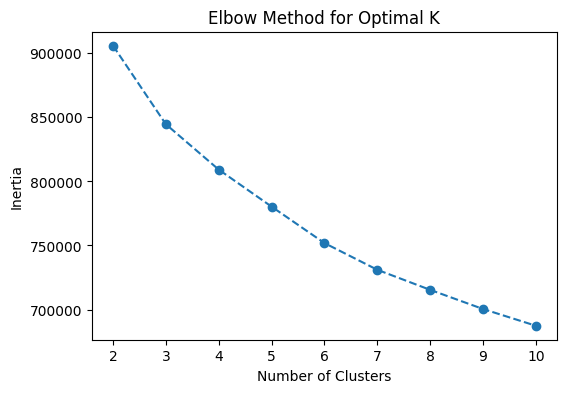
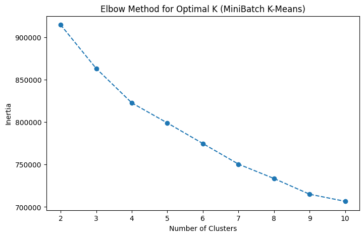

# Euphoria Clustering Analysis

**Team Members:** 
- Captain: Yerassyl Abilkhair,303921
- Member 2: Satybaldiev Beksultan,304191
- Member 3: Tamerlan Myrzabek,305171

---

## 1. Introduction

Euphoria is a digital archipelago of islands, each offering unique experiences. The goal of this project is to segment these islands based on their "happiness levels" so that visitors can discover their ideal destination. Using unsupervised learning, specifically clustering techniques, we group similar islands together. The dataset `euphoria.csv` describes various attributes of these islands, from infrastructure and amenities to environmental and demographic features.

---

## 2. Methods

### Dataset Overview

The dataset includes the following features:
- `referral_friends`: Number of friends referred.
- `water_sources`: Quantity of fresh water.
- `shelters`: Number of dwellings.
- `fauna_friendly`: Presence of pets or wildlife.
- `island_size`, `creation_time`, `region`, `happiness_metric`, `features`, `happiness_index`, `loyalty_score`, etc.

### Preprocessing and Feature Engineering

- **Categorical Encoding:** Label Encoding was used for `region`, `fauna_friendly`, and `nearest_city`.
- **Scaling:** All numerical features were standardized using `StandardScaler`.
- **Feature Selection:** `happiness_index` was removed before clustering to prevent label leakage.

### Clustering Algorithms Applied

- **K-Means**: Centroid-based clustering.
- **MiniBatch K-Means**: A faster approximation of K-Means.
- **DBSCAN**: Density-based clustering algorithm for irregular clusters and outlier detection.

### Workflow Overview

This heatmap allowed us to identify multicollinearity and correlated inputs before clustering.

---

## 3. Experimental Design

### Main Purpose

Segment the islands based on their happiness features to discover latent groups with similar visitor experiences.

### Baselines

- **K-Means** and **MiniBatch K-Means** serve as baseline clustering methods.
- **DBSCAN** is tested for non-linear, density-based patterns.

### Evaluation Metrics

- **Silhouette Score:** Measures cohesion and separation of clusters.
- **Cluster Distribution:** Checks cluster balance and structure.

---

## 4. Results

### Heatmap of Feature Correlation

This shows the correlation structure among variables pre-clustering.

### K-Means Clustering

- **Silhouette Score:** `0.0968`
- **Number of Clusters:** 4

K-Means provided clearly separated clusters with relatively even distribution.

### MiniBatch K-Means Clustering

- **Silhouette Score:** `0.0833`
- **Number of Clusters:** 4

MiniBatch K-Means showed similar structure to standard K-Means with slightly varied grouping.

### DBSCAN Clustering

- **Silhouette Score:** `-0.4635`
- **Clusters Found:** 107 (many small/noise points)

DBSCAN struggled due to high-dimensional sparsity and inconsistent densities.

---

## 5. Conclusion

This project demonstrates the effectiveness of unsupervised clustering in segmenting islands based on happiness-driven features in the world of Euphoria. K-Means and MiniBatch K-Means revealed four meaningful groups that can guide digital travelers in selecting their ideal destination.

While DBSCAN was less effective on this dataset, future directions could include:
- Trying hierarchical clustering or Gaussian Mixture Models.
- Refining features using PCA for dimensionality reduction.
- Applying supervised validation (e.g., classification with `happiness_index`).

---

*End of our report, thank you for attention:)*
